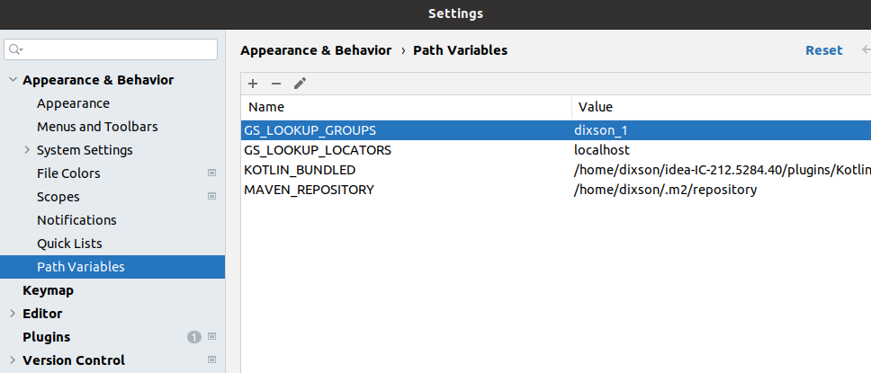

# gs-core-dev-training

Before you start please verify that you have on your machine the following:

1. `JDK` - Oracle JDK or OpenJDK, preferably version 17.
1. `Maven`
1. `Intellij` - this is the preferred Java IDE, although other IDEs will work.

Go to the location where you want lab content to be stored and perform the following:

Or:

Download the zip from this repository and extract it, preferably to your home directory.
 
## Contents

| Lab | Topic                                                                                                                               | Directories |
|----|-------------------------------------------------------------------------------------------------------------------------------------|---|
| -  | Jupyter notebooks covering the core GigaSpaces API: reads/writes/queries, the Change API, colocated Task execution, and aggregation | `gs-dev-jupyter-lab` |
| 11 | Space-Based Remoting - broadcast and routed executor remoting patterns against the BillBuddy sample app                             | `lab11-space_based_remoting-exercise`, `lab11-space_based_remoting-solution` |
| 12 | Event Processing - `@Polling`/`@Notify` event containers                                                                            | `lab12-event_processing-exercise`, `lab12-event_processing-solution` |
| 13 | Transactions - transactional event processing                                                                                       | `lab13-transactions-exercise`, `lab13-transactions-solution` |
| 14 | Persistency - Mirror Service, asynchronous persistence to an external database                                                      | `lab14-persistency-exercise`, `lab14-persistency-solution` |
| 15 | Durable Task - registering a durable, failover-surviving business logic task                                                        | `lab15-durable_task-example` |
| 16 | JDBC v3 - SQL queries, joins, aggregates, and dynamic DDL/DML via the GigaSpaces JDBC driver                                        | `lab16-jdbc_v3-example` |
| 17 | Custom Aggregator - a custom `SpaceEntriesAggregator` compared against an equivalent plain SQL query                                | `lab17-custom_aggregator-example` |
| 18 | Dynamic Filter - the JDBC `DYNAMIC_FILTER` hint and how routing alignment affects colocated joins                                   | `lab18-dynamic_filter-example` |
| 19 | Distributed Tracing - OpenTelemetry-based tracing with Zipkin as the backend                                                        | `lab19-distributed_tracing-example` |
| 20 | Billing App - a full blueprint-generated multi-module billing application, deployable locally or to Kubernetes                      | `lab20-billing_app-example` |
| 21 | Property Storage Adapter - a custom `PropertyStorageAdapter` that transparently compresses an XML property                          | `lab21-storage_adapter-example` |

##### Note 1 - Downloading Gigaspaces jars

Some corporate networks do not allow connecting directly to external Maven repositories. In this case, run:

`$GS_HOME/bin/gs maven install`

This will copy the GigaSpaces jars (bundled with your installation) to your local .m2 Maven repository.

##### Note 2 - runConfigurations

Many labs will have an instruction to 'Copy the runConfigurations directory to the .idea folder to enable the Java Application configurations.'

The accompanying lab folder will have a runConfigurations directory containing xml files. These are example configurations to run a Java Program from within Intellij. Copy the entire runConfigurations folder into the Intellij .idea folder (the .idea folder gets created when you open the Maven project in Intellj). You will then need to restart Intellij.

You can also set the environment variables used by Intellij. Go to Settings | Appearance & Behavior | Path Variables.

##### Note 3 - Oshi
If Oshi related errors prevent Gigaspaces from starting, you can disable Oshi by setting in the `bin/setenv-overrides, export GS_OPTIONS_EXT="-Dcom.gs.oshi.enabled=false"`

##### Note 4 - The Gigaspaces processes don't appear under Hosts tab
In the `bin/setenv-overrides, export GS_OPTIONS_EXT="-Djava.net.preferIPv4Stack=true"`

##### Note 5 - java.lang.UnsatisfiedLinkError with JNA on Mac
java.lang.UnsatisfiedLinkError on Mac with JNA error. Download the latest jna jar. Replace the lib/optional/oshi/jna.jar with the new jar (remove version from jna.jar). JNA is used to provide host machine information displayed in GigaSpaces.
