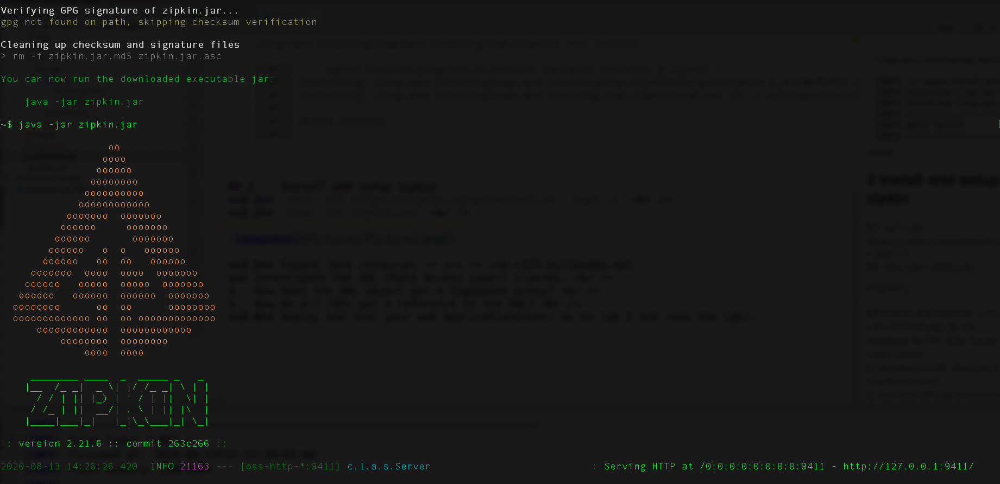
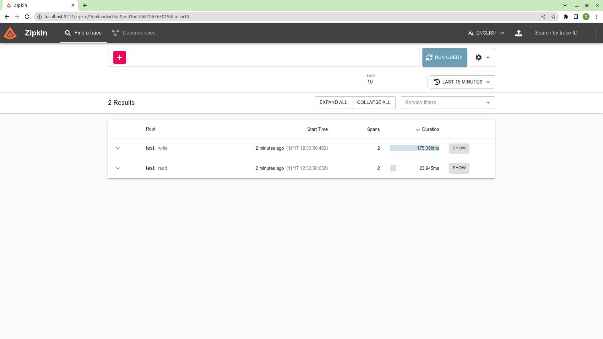

# gs-dev-training - lab19-distributed_tracing-example

## Distributed Tracing (OpenTelemetry + Zipkin)

###### Lab Goals
1. Get familiar with Distributed Tracing using OpenTelemetry. Distributed tracing can be used to improve performance and code efficiency.
2. Install and set up Zipkin as the tracing backend.
3. Use GigaSpaces with OpenTelemetry-based distributed tracing activated.

###### Lab Description
This lab includes the needed instructions and code to activate and use distributed tracing with GigaSpaces.  
GigaSpaces uses the OpenTelemetry API for tracing and supports Zipkin as the built-in tracing backend via `ZipkinTracerBean`.  
Because GigaSpaces uses the vendor-agnostic OpenTelemetry API, it's possible to configure other OpenTelemetry-compatible exporters (such as Jaeger or OTLP) by registering the appropriate SDK exporter directly.
- Note: GigaSpaces does not provide a built-in bean for these.
- OpenTelemetry support was added in GigaSpaces version 17.2.0.

## Lab setup
Make sure you restart the service grid and gs-ui (or at least undeploy all Processing Units using gs-ui).

1. Start the demo:  
   Go to `$GS_HOME/bin`  
   Run `./gs.sh demo` or `gs.bat demo`

   *This starts an agent, manager, 4 gscs, restv3 and the webui. It also deploys a space named 'demo' with 2 partitions and 1 backup apiece.*
2. Open gs-dev-training/lab19-distributed_tracing-example project with IntelliJ (open pom.xml)
3. Run `mvn compile`

## Install and Set Up Zipkin
###### Option 1 - Run the Zipkin Docker container 
`docker run -d -p 9411:9411 openzipkin/zipkin`

###### Option 2 - Download and run the Zipkin self-contained executable jar
1. `curl -sSL https://zipkin.io/quickstart.sh | bash -s` 
2. `java -jar zipkin.jar`

## Examine the code

Expand src -> main -> java -> com.gs -> `TraceHelper.java` and investigate the code.

## Run TraceHelper main
Perform GigaSpace operations when Zipkin is enabled.  
###### Option 1 - Using Maven CLI:

`cd ~/gs-core-dev-training/lab19-distributed_tracing-example`

`mvn exec:java  -D"exec.mainClass"="com.gs.TraceHelper" -Dexec.classpathScope=compile -Dcom.gs.jini_lus.locators=localhost`

###### Option 2 - Using IntelliJ:

1. Copy the entire `runConfigurations` folder and its contents from this project, into the `.idea` directory. You will need to restart IntelliJ.
2. Make sure the `GS_LOOKUP_LOCATORS` and `GS_LOOKUP_GROUPS` environment variables are set correctly.  
   For example, the `GS_LOOKUP_LOCATORS=localhost` and `GS_LOOKUP_GROUPS=xap-17.2.1`.

   In each of the IntelliJ run configurations, there will be VM options that will reference these environment variables.

   For example,  
   `-Dcom.gs.jini_lus.locators=${GS_LOOKUP_LOCATORS}` and `-Dcom.gs.jini_lus.groups=${GS_LOOKUP_GROUPS}`.

   Please see the main [README.md](https://github.com/GigaSpaces-ProfessionalServices/gs-core-dev-training/blob/main/README.md) for setting path values (environment variables in File | Settings | Appearance & Behavior | Path Values) used when running within IntelliJ.
3. Build the project: `mvn package`

## Login to Zipkin console and verify the results
1. Open http://localhost:9411 in a browser.

2. Explore recent Trace IDs:

## Online documentation
See: https://docs.gigaspaces.com/latest/admin/admin-distributed-tracing.html