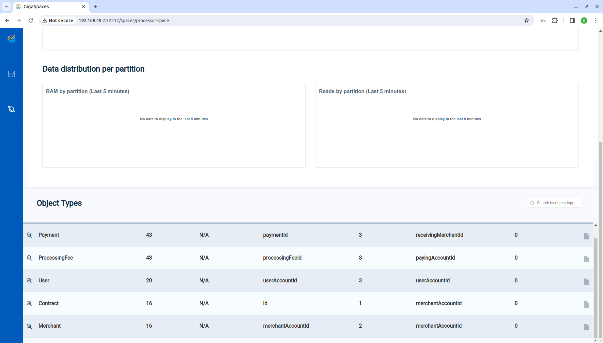
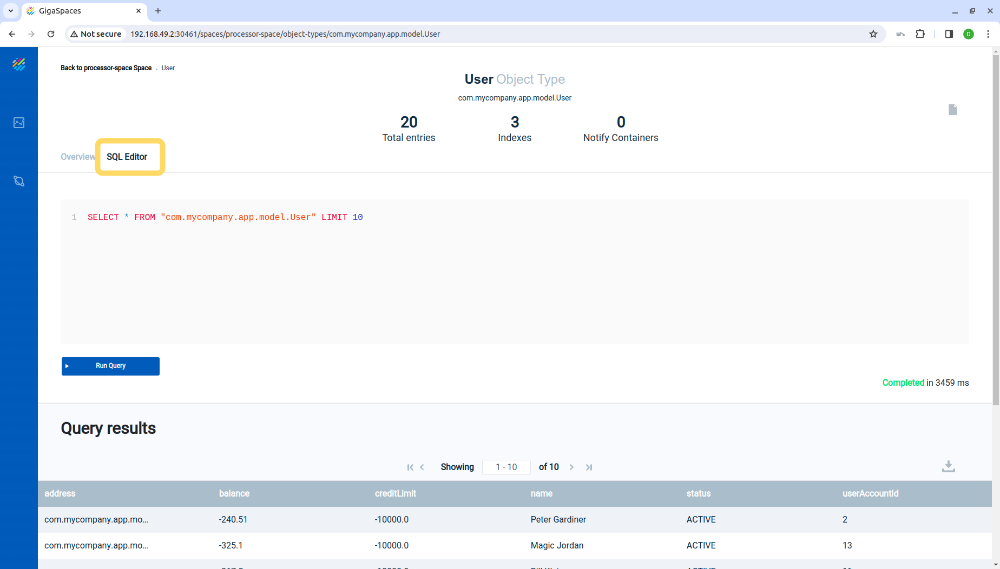

# Bill Payment Example

---

## Goals

1. This is an example project that simulates a bill payment application.
2. There are merchant, users and payments. The payments are randomly generated.
3. The features selected for this example will demonstrate some of the capabilities of GigaSpaces in low-latency, high performance application.
4. In addition, there will be detailed steps for deployment.

## Prerequisites

1. `JDK` - Oracle or OpenJDK, preferably version 11.
2. [Maven](https://maven.apache.org/install.html)
3. `curl` command line client url
4. Java IDE such as [Intellij Community Edition](https://www.jetbrains.com/idea/download/)
5. [Docker](https://docs.docker.com/engine/install/)
6. Kubernetes environment for example [minikube](https://minikube.sigs.k8s.io/docs/start/), but any k8s environment can work.
7. [helm](https://helm.sh/docs/intro/install/)
8. GigaSpaces installation for local testing.

---

## 1. Build

1. Run `scripts/build.sh`. This script will run mvn install and run the docker build commands. You will need to have your Docker access token ready.

## 2. Run on Kubernetes environment

1. Run `scripts-k8s/deploy-k8s.sh`  
*This will set up the helm repository, install the Manager, operator and space.*
You can verify with the following:
```
$ helm list
NAME     	NAMESPACE	REVISION	UPDATED                                	STATUS  	CHART              	APP VERSION
manager  	default  	1       	2024-03-26 13:58:14.976120909 -0400 EDT	deployed	xap-manager-16.4.0 	           
operator 	default  	1       	2024-03-26 13:58:23.440944168 -0400 EDT	deployed	xap-operator-16.4.0	           
processor	default  	1       	2024-03-26 13:58:32.081939187 -0400 EDT	deployed	xap-pu-16.4.0      	
```
2. Run the `scripts-k8s/payment-feeder.sh`  
*This will set up the payment feeder job.*
3. Run the `scripts-k8s/rest-app.sh`  
*This will set up the rest application.*
You can verify with the following:
```
$ kubectl get all
NAME                                READY   STATUS    RESTARTS      AGE
pod/payment-feeder-jjd8g            1/1     Running   0             4m31s
pod/processor-xap-pu-0              1/1     Running   0             3m31s
pod/rest-app-5dbfc58fcc-w4h9d       1/1     Running   1 (67s ago)   4m23s
pod/xap-manager-0                   1/1     Running   0             7m51s
pod/xap-operator-5d8958869d-zmkt6   1/1     Running   0             7m42s

NAME                          TYPE        CLUSTER-IP       EXTERNAL-IP   PORT(S)                               AGE
service/kubernetes            ClusterIP   10.96.0.1        <none>        443/TCP                               9m45s
service/manager-np            NodePort    10.105.79.153    <none>        8090:30461/TCP                        7m50s
service/processor-xap-pu-hs   ClusterIP   None             <none>        <none>                                3m32s
service/rest-app              NodePort    10.100.45.17     <none>        8080:30110/TCP                        4m23s
service/webhook-server        ClusterIP   10.111.156.173   <none>        8443/TCP                              7m42s
service/xap-manager-hs        ClusterIP   None             <none>        2181/TCP,2888/TCP,3888/TCP,4174/TCP   7m51s
service/xap-manager-service   ClusterIP   10.103.105.134   <none>        8090/TCP,4174/TCP                     7m51s

NAME                           READY   UP-TO-DATE   AVAILABLE   AGE
deployment.apps/rest-app       1/1     1            1           4m23s
deployment.apps/xap-operator   1/1     1            1           7m42s

NAME                                      DESIRED   CURRENT   READY   AGE
replicaset.apps/rest-app-5dbfc58fcc       1         1         1       4m23s
replicaset.apps/xap-operator-5d8958869d   1         1         1       7m42s

NAME                                READY   AGE
statefulset.apps/processor-xap-pu   1/1     3m31s
statefulset.apps/xap-manager        1/1     7m51s

NAME                       COMPLETIONS   DURATION   AGE
job.batch/payment-feeder   0/1           4m31s      4m31s
```

## 3. Validation on Kubernetes environment

### minikube
1. `minikube service manager-np --url` will give access to ops-ui. The url to access the NodePort will be returned. Copy the url and paste in your browser's url bar.  
Click on 'Monitor my services' | click on the 'processor' service | click on the 'Space:processor-space' button (top right corner).  
You should see a list of types. See screenshot below.  


2. You can also run queries from the ops-ui. Choose the 'SQL Editor' pane. We have run `SELECT * from "com.mycompany.app.model.User" LIMIT 10`

3. You can check the rest application by running curl commands against it.  
If running on minikube, you can get access to tne rest application service's NodePort using  
`minikube service manager-np --url`  
Visit this [page](notes.md) for a list of curl commands that can be run.

## Other Kubernetes environment
1. To get access to the ops ui, `kubectl port-forward svc/xap-manager-service 8090:8090`. The ops-ui should be available on `localhost:8090`. Check the minikube section above for notes on the ops-ui.
2. For the rest application, `kubectl port-forward deployment/rest-app 8080:8080`.  
Visit this [page](notes.md) for a list of curl commands that can be run.

## 3. Run on local desktop

Start the service grid

1. In a new console window, run `scripts/service-grid.sh`  
   *This starts the GigaSpaces components such as the manager and the GSCs. The space will be deployed onto the GSCs.*
2. Deploy the space. In a new console window, run `scripts/deploy-processor.sh`  
   *This deploys the space and the server side code.*
3. Deploy the feeder. In a new console window, run `scripts/run-feeder.sh`  
   *This creates the users and the merchants. It also runs continuously, simulating payments transactions*
4. Deploy the REST application. In a new console window, run `scripts/run-rest-app.sh`  
   *The REST application is used for reporting on the billing application*
5. Visit this [page](notes.md) for a list of curl commands that can be run.

